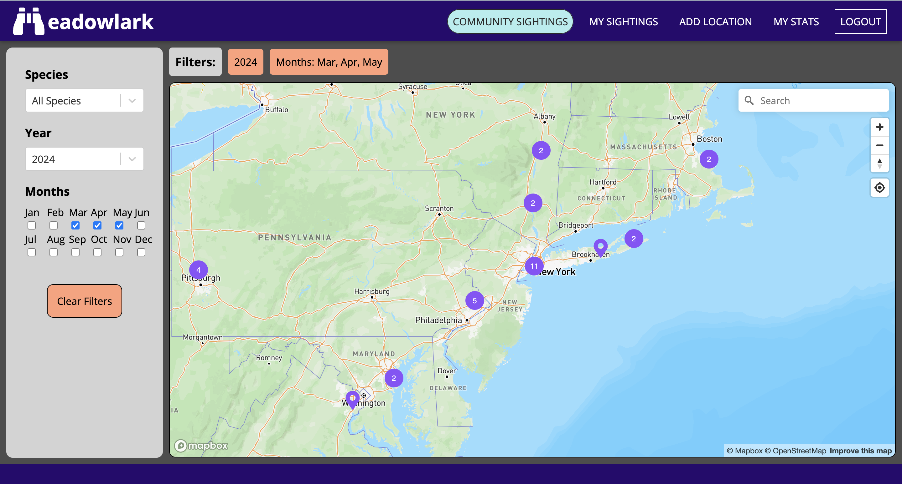
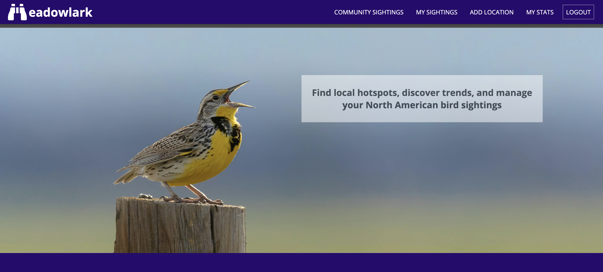
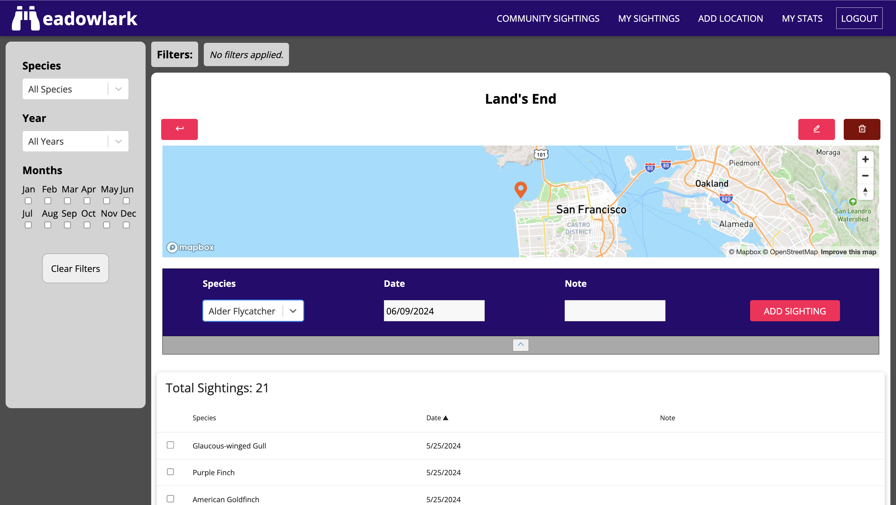
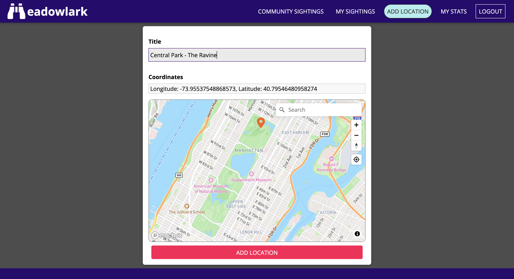
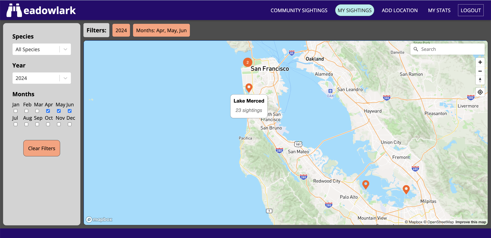

# Meadowlark Birding App

  ## Visit

  Meadowlark is live at www.meadowlark-birding.com.

  ## About

  Meadowlark is a web application that enables birdwatchers to log, organize, and publicly share their bird sightings, contributing to an ever-growing database of geographically organized bird sighting data. The mission of the site is to enable users to pinpoint the location of specific species in their area by querying the data submitted by other users. To this end, the site features a series of maps, filters, search fields, and sort options, allowing users to quickly sift through the data and view the sightings as map markers relative to their current location. Additionally, users can manage and organize their personal sighting data in a "My Stats" page, keeping track of their performance and sighting trends.

  ## Tech Stack

  ### Frontend

  - React 
  - React Router
  - MapBox GL JS

  ### Backend

  - Node.js
  - Express.js
  - MondoDB
  - Mongoose
  - JSON Web Token

  ## Features

  ### Mapping Features

  - Beautiful, responsive maps (powered by Mapbox) display the locations of bird sightings in the user's area
  - Map markers and popups are generated dynamically from user inputted data
  - Geolocation: maps are configured to automatically load on user's location
  - Geocoding: maps can be searched for streets, places, geographic features, etc. 
  - Map markers are displayed or hidden based on selected filter values 

  ### Filters, Sorting, and and Search Functionality

  - All bird sighting data tables can be filtered and sorted by species, year, month, and date
  - Map markers can be filtered by species, year, and month
  - The "My Stats" data table extends these filters to include the ability to search all fields, filter by date range, and return only unique species data

  ### Data Organization and Operations

  - Users create 'locations' which serve as collections of 'sightings'. Each location is displayed as a map pin, which, when selected, routes to a dedicated location page
  - Each location page houses a data table listing all associated sightings. Each table row includes a species, location, date, and (optional) note
  - All locations and sightings can be added, viewed, updated, and deleted
  - All locations and sightings are publicly viewable, even to guests and non-authenticated users
  - The "My Stats" page data table includes all of a user's sightings, regardless of location. This table can be searched, sorted, and filtered

  ### Authentication, Security, and User Management

  - Secure login / signup functionality
  - "Guest Login" enables visitors to explore all features of the site without adding persistant data to the database 
  - User authentication using JSON Web Token 
  - Password encryption
  - Session tokens manage authentication status
  - Strict data protections allow data only to be modified by the user who created the data

  ### Validation 

  - Locations: User inputted coordinates is validated to ensure they are within North America
  - Sightings: User inputted sighting data is validated to ensure a species is included the Audubon society's list of North American bird species
  - Users: Credentials are validated to ensure they are unique

  ## Contact 

  - Email: Anthonykovatch@gmail.com
  - [LinkedIn](https://www.linkedin.com/in/anthony-kovatch-45b674310/)

  

  ## Screenshots:

  

***

  

***

  

***

  

***

  

***

  

  
